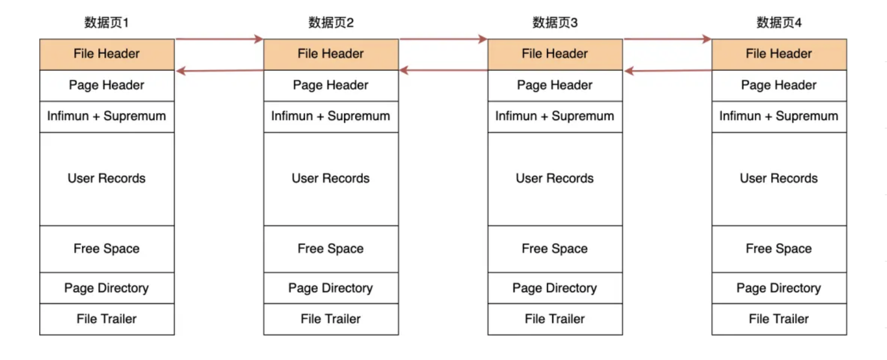
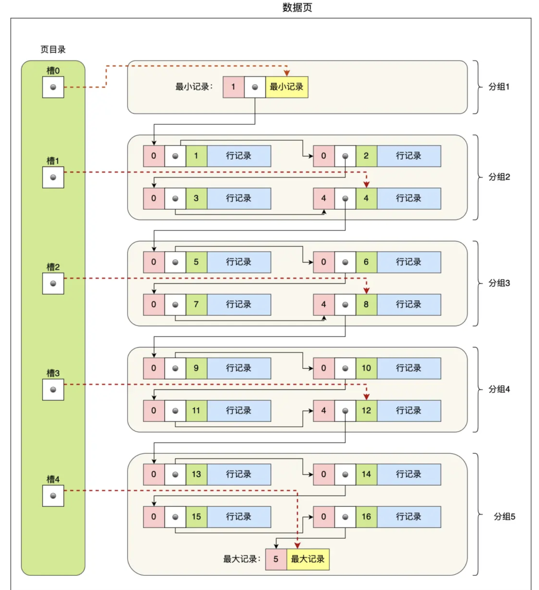
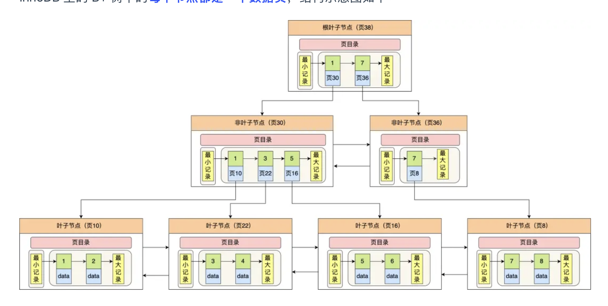
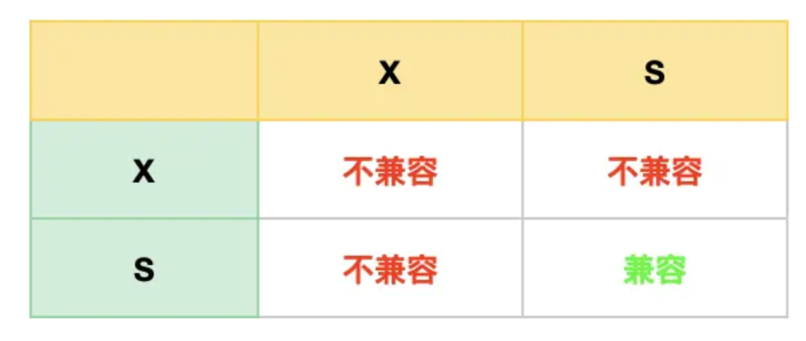
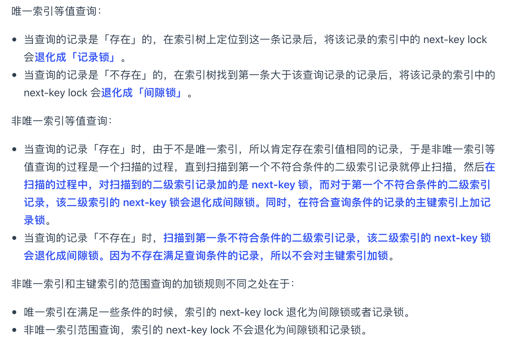
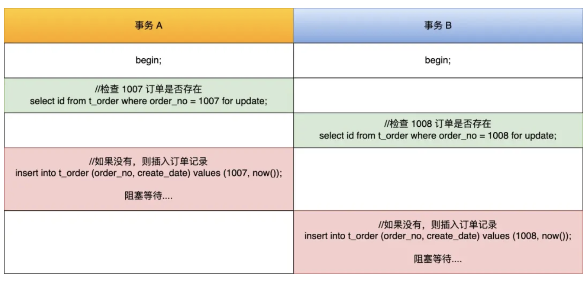
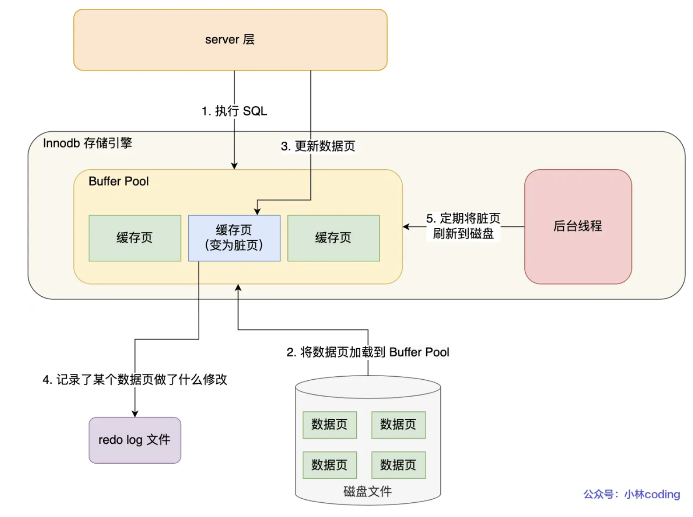

# 大纲
> 本文是参考自「[小林图解](https://xiaolincoding.com/mysql/index/page.html)」并整理一些见解所得
> 1. 一条sql的执行流程
>       连接 -> 缓存 -> 解析 -> 执行( 预处理 -> 优化 -> 执行计划)
> 2. Mysql是如何存储数据的
>       行-> 页 -> 区 -> 段 -> 独占表空间。
>       行作为记录单位，常见Compact形式：变长字段长度+Null值列表+行记录头｜row_id+trx_id+roo_ptr｜真实数据
> 3. Mysql中的索引
>       
> 4. Mysql中的锁


# 索引
## 从数据页的角度中看待B+树

**页内**是一种叫做「槽」的数据结构；**页间**通过B+树进行索引组织成区。

数据页内包含用户记录，每个记录之间用单向链表的方式组织起来，为了加快在数据页内高效查询记录，设计了一个页目录，页目录存储各个槽（分组），且主键值是有序的，于是可以通过二分查找法的方式进行检索从而提高效率。

为了高效查询记录所在的数据页，InnoDB 采用 b+ 树作为索引，每个节点都是一个数据页。

InnoDB通过叶子结点来存储真实数据，则为聚簇索引，且只能有一个（如果没有主键，会找第一个不为Null的唯一列作为主键，再没有就会生成隐主键）；存储二级索引主键对的时候，则为二级索引，此时不存储真实数据。

在使用二级索引进行查找数据时，如果查询的数据能在二级索引找到，那么就是「索引覆盖」操作，如果查询的数据不在二级索引里，就需要先在二级索引找到主键值，需要去聚簇索引中获得数据行，这个过程就叫作「回表」。

## 索引失效情况

# 事务

## Mysql中事务的隔离级别

并行事务所引发的问题：
    1. 如果一个事务 **「读到」**了另一个「未提交事务修改过的数据」，就意味着发生了 **「脏读」** 现象。
    2. 在一个事务内**多次读取同一个数据**，如果出现前后两次读到的数据不一样的情况，就意味着发生了「不可重复读」现象。
    3. 在一个事务内多次查询某个符合查询条件的「记录数量」，如果出现**前后两次查询到的记录数量不一样**的情况，就意味着发生了「幻读」现象。

所支持的隔离界别：
    1. 读未提交（read uncommitted），指一个事务还没提交时，它做的变更就能被其他事务看到；
    2. 读提交（read committed），指一个事务提交之后，它做的变更才能被其他事务看到；
    3. **可重复读（repeatable read）**，指一个事务执行过程中看到的数据，一直跟这个事务启动时看到的数据是一致的，MySQL InnoDB 引擎的默认隔离级别；
    4. 串行化（serializable ）；会对记录加上读写锁，在多个事务对这条记录进行读写操作时，如果发生了读写冲突的时候，后访问的事务必须等前一个事务执行完成，才能继续执行；

对于使用「读提交」和「可重复读」两种情况，是通过**ReadView**来实现的。
- 「读提交」隔离级别是在 **「每个语句执行前」** 都会重新生成一个 Read View，而「可重复读」隔离级别是 **「启动事务时」** 生成一个 Read View，然后整个事务期间都在用这个 Read View。

MVCC机制：


针对幻读问题，InnoDB使用两种方法来解决：
- 快照读(select)，使用MVCC方式解决；
- 当前读(select...for update)，使用间歇锁+记录锁。通过加上 next-key lock，如果有其他事务在 next-key lock 锁范围内插入了一条记录，那么这个插入语句就会被阻塞，无法成功插入，所以就很好了避免幻读问题。
- 当然并无法完全避免幻读。所以要避免这类特殊场景下发生幻读的现象的话，就是*尽量在开启事务之后，马上执行 select ... for update 这类当前读*的语句，因为它会对记录加 next-key lock，从而避免其他事务插入一条新记录。


# 锁

## Mysql都有哪些锁

### 行级锁

```sql
flush tables with read lock
unlock tables
```

因为在可重复读的隔离级别下，即使其他事务更新了表的数据，也不会影响备份数据库时的 Read View，这就是事务四大特性中的隔离性，这样备份期间备份的数据一直是在开启事务时的数据。

### 表级锁

1. 表锁
` lock tables t_student read; `
粒度粗，导致并发性差

2. 元数据锁MDL
MDL 是在事务提交后才会释放，这意味着**事务执行期间**，MDL是一直持有的。MDL拥有锁阻塞的特性，即拥有MDL读锁时，MDL写阻塞，反之。
缺点：长事务下，因为申请 MDL 锁的操作会**形成一个队列**，队列中写锁获取优先级高于读锁，一旦出现 MDL 写锁等待，会阻塞后续该表的所有 CRUD 操作。

3. 意向锁
```sql
//普通的select通过MVCC实现并发，并不需要锁，但也可以通过如下方式使用：
//先在表上加上意向共享锁，然后对读取的记录加共享锁
select ... lock in share mode;

//先表上加上意向独占锁，然后对读取的记录加独占锁
select ... for update;
```

> 意向共享锁和意向独占锁是表级锁，不会和 *行级的共享锁和独占锁* 发生冲突，而且**意向锁之间也不会发生冲突**，只会和共享表锁（lock tables ... read）和独占表锁（lock tables ... write）发生冲突。
> **意向锁的目的是为了快速判断表里是否有记录被加锁。**

4. AUTO-INC锁

之后可以在插入数据时，可以不指定主键的值，数据库会自动给主键赋值递增的值，这主要是通过 AUTO-INC 锁实现的。

AUTO-INC 锁是特殊的表锁机制，锁不是再一个事务提交后才释放，而是再执行完插入语句后就会立即释放。

### 行级锁(InnoDB)

共享锁（S锁）满足读读共享，读写互斥。独占锁（X锁）满足写写互斥、读写互斥。


1. Record Lock (记录锁，锁住的是一条记录)

S锁之间可互相兼容，但S与X、X与X锁之间不兼容。

2. Gap Lock (间歇锁，只存在于可重复读隔离级别，目的是为了解决可重复读隔离级别下幻读的现象。)

间隙锁之间是兼容的，即两个事务可以同时持有包含共同间隙范围的间隙锁，并不存在互斥关系，因为间隙锁的目的是防止插入幻影记录而提出的

3. Next-Key Lock (临键锁)

next-key lock 是包含间隙锁+记录锁的，如果一个事务获取了 X 型的 next-key lock，那么另外一个事务在获取相同范围的 X 型的 next-key lock 时，是会被阻塞的。

4. 插入意向锁 (锁记录的NK-Lock)

插入数据之前，会**检查插入位置是否拥有间歇锁**。如果有的话，插入操作就会发生阻塞，直到拥有间隙锁的那个事务提交为止（释放间隙锁的时刻），在此期间会生成一个插入意向锁，表明有事务想在某个区间插入新记录，但是现在处于等待状态。

当事务 A 还没提交的时候，事务 B 向该表插入一条 id = 4 的新记录，这时会判断到插入的位置已经被事务 A 加了间隙锁，于是事物 B 会生成一个插入意向锁，然后将锁的状态设置为等待状态（PS：MySQL 加锁时，是先生成锁结构，然后设置锁的状态，如果锁状态是等待状态，并不是意味着事务成功获取到了锁，只有当锁状态为正常状态时，才代表事务成功获取到了锁），此时事务 B 就会发生阻塞，直到事务 A 提交了事务。

## 如何加锁的

首先只有InnoDB才会加行级锁，且只有在锁定读(select...for update--X锁)下，会触发加锁，当事务提交后，锁会被释放。

**加锁的对象是「索引」，加锁的基本单位是「next-key lock」，它是由记录锁和间隙锁组合而成的，next-key lock 是前开后闭区间，而间隙锁是前开后开区间。**

在某些场景下，会退化成记录锁或间歇锁：**在能使用记录锁或者间隙锁就能避免幻读现象的场景下， next-key lock 就会退化成记录锁或间隙锁。**

从避免发生幻读的角度来看，最优性能从而触发加不同的锁：


PS：在使用 update、delete、select ... for update 等具有加锁性质的语句，一定要检查语句是否走了索引，如果是**全表扫描的话，会对每一个索引加 next-key 锁，相当于把整个表锁住了**。
PPS：全表扫描，锁是在遍历索引的时候加上的，并不是**针对输出的结果加锁**。

## 发生死锁的情况

引发本质：**两个事务均等待另一个事务释放锁，且所加的间隙锁是兼容的，即两个X型间隙锁可兼容锁统一范围。**间隙锁的意义是用来放置，区间范围被插入的。因此，共享锁和独占锁的间隙锁是相同的意义。这里指所加的是间隙锁，而不是「间隙+记录」锁，后者是会触发阻塞的。


通过插入意向锁（本质是特殊的点插间隙锁），对单条记录互斥。

如何避免？（四个原则：互斥、占有且等待、不可强占用、*循环等待*）

从发生死锁时解决：
- 设置等待超时限制 `innodb_lock_wait_timeout` 参数调整
- 开启主动死锁检测 `innodb_deadlock_detect` 设置为on

从业务的角度避免：
可以回归业务的角度来预防死锁，对订单做幂等性校验的目的是为了保证不会出现重复的订单，那我们可以直接将 order_no 字段设置为唯一索引列，**利用它的唯一性来保证订单表不会出现重复的订单**，不过有一点不好的地方就是在我们插入一个已经存在的订单记录时就会抛出异常。

## 死锁分析
[从字节的例题来看为什么发生死锁](https://xiaolincoding.com/mysql/lock/show_lock.html#time-3-阶段加锁分析)
# 日志

> Mysql在执行更新语句时，会使用三个日志：
## undolog 

> 是 Innodb 存储引擎层生成的日志，实现了事务中的**原子性**，主要用于事务回滚和 MVCC。
> undolog日志还可通过 ReadView + undo log 实现 MVCC（多版本并发控制）。

即使没有使用`begin`和`commit`仍，mysql会自动开通`autocommit`开进行「隐事务」的提交。在事务没提交前，会将记录记录到undolog日志内。


## redolog 

> 是 Innodb 存储引擎层生成的日志，实现了事务中的**持久性**，主要用于掉电等故障恢复；

为了防止断电导致数据丢失的问题，当有一条记录需要更新的时候，InnoDB 引擎就会先更新内存（同时标记为脏页），然后将本次对这个页的修改以 redo log 的形式记录下来，这个时候更新就算完成了。后续，InnoDB 引擎**会在适当的时候，由后台线程将缓存在 Buffer Pool 的脏页刷新到磁盘里**，这就是 WAL （Write-Ahead Logging）技术。WAL 技术指的是， MySQL 的写操作并不是立刻写到磁盘上，而是先写日志，然后在合适的时间再写到磁盘上。

PS：redolog是先写到内存上的，pool中，再集中写入到磁盘持久化的。

什么时候刷新至磁盘呢？
- MySQL 正常关闭时；
- 当 redo log buffer 中记录的写入量大于 redo log buffer 内存空间的一半时，会触发落盘；
- InnoDB 的后台线程每隔 1 秒，将 redo log buffer 持久化到磁盘。
- 每次事务提交时都将缓存在 redo log buffer 里的 redo log 直接持久化到磁盘（这个策略可由 innodb_flush_log_at_trx_commit 参数控制，下面会说）。



与undolog的区别：
- redo log 记录了此次事务「完成后」的数据状态，记录的是**更新之后**的值；用于提交事务后，发生崩溃恢复数据。
- undo log 记录了此次事务「开始前」的数据状态，记录的是**更新之前**的值；用于未提交事务时，发生崩溃恢复数据。

为什么需要redolog呢？
- 实现事务的持久性，让 MySQL 有 crash-safe（崩溃恢复） 的能力，能够保证 MySQL 在任何时间段突然崩溃，重启后之前已提交的记录都不会丢失；
- 将写操作从「随机写」变成了「顺序写」，提升 MySQL 写入磁盘的性能。


## binlog

> 是 Server 层生成的日志（所有存储引擎均可用），主要用于数据备份和主从复制；

MySQL 在完成一条更新操作后，Server 层还会生成一条 binlog，等之后事务提交的时候，会将该事物执行过程中产生的所有 binlog 统一写 入 binlog 文件。binlog 文件是记录了所有数据库表结构变更和表数据修改的日志，不会记录查询类的操作，比如 SELECT 和 SHOW 操作。

## Mysql是如何实现主从复制的

## 磁盘IO很高，如何优化？


# 内存